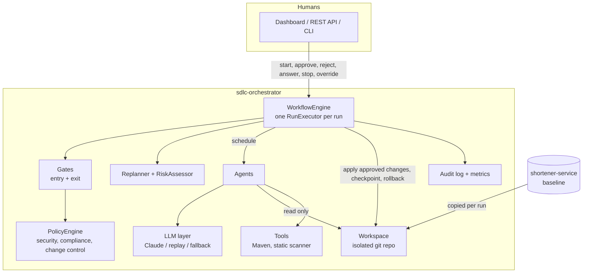
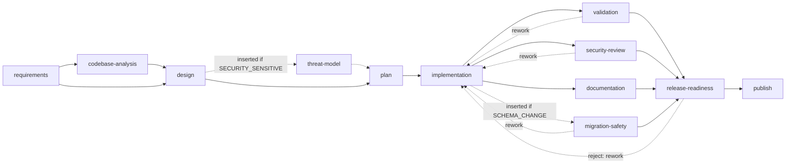
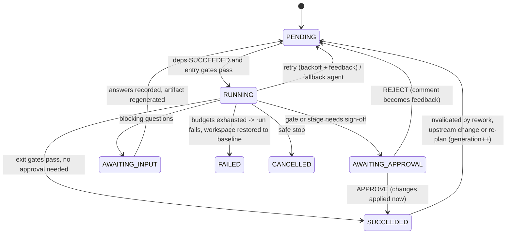

# Architecture

## 1. Components

| Component | Responsibility | Key classes |
|---|---|---|
| Workflow model | Explicit DAG of stages; validation, topological order, atomic insertion | `WorkflowGraph`, `StageDefinition`, `WorkflowTemplates` |
| Engine | Stateful, event-driven scheduler; all state transitions | `RunExecutor`, `RunState`, `WorkflowEngine` |
| Gates | Deterministic entry and exit checks returning PASS, FAIL, NEEDS_APPROVAL or NEEDS_INPUT | `StandardGates`, `GateRegistry` |
| Policy | Change-control, security and compliance rules over proposed file changes | `PolicyEngine`, `*Rule` |
| Agents | Model-backed (requirements, analysis, design, threat model, planning, implementation, docs) and tool-backed (validation, security review, migration safety, release readiness, publish) | `agent/*` |
| LLM layer | Structured outputs via the Anthropic Java SDK; deterministic replay; provider fallback | `AnthropicLlmClient`, `ReplayLlmClient`, `RoutingLlmClient` |
| Workspace | Per-run git copy of the target; checkpoints, rollback, diff | `Workspace`, `GitWorkspaceFactory` |
| Observability | Hash-chained audit trail, cross-run reliability metrics | `AuditLog`, `ReliabilityMetrics` |
| Interfaces | REST API, dashboard, headless CLI demo | `RunController`, `index.html`, `DemoRunner` |

## 2. Orchestration model

### The SDLC graph

Every stage declares: dependencies, entry gates, exit gates, an approval mode (`NEVER`, `ALWAYS`,
`RISK_BASED`), a retry budget, an optional fallback agent, an optional rework target, a timeout and,
for stages that write code, an allowed-paths boundary.

### Stage state machine

### Why event-driven, single-writer

Agents run concurrently on virtual threads, but **they never mutate run state or the workspace**.
Each agent returns a `StageOutcome`: an artifact plus, for writers, a *proposed* `ChangeSet`. The
outcome is posted to the run's event queue. One scheduler thread owns every transition: it evaluates
gates, requests approvals, applies changes, commits checkpoints and schedules what comes next.

That design gives four guarantees:

1. **Serial, auditable transitions.** Every change in state is one event handled by one thread and logged before the next.
2. **Harmless cancellation.** A stale or cancelled agent can only post a result. The engine compares the result's `generation` and `execution` with the stage's current values and discards it (`STALE_RESULT_DISCARDED`).
3. **Policy before side effects.** Nothing reaches the workspace until the change-policy gate passes and, if required, a human approves.
4. **Consistent rollback.** The workspace only changes at checkpoints, so `git reset --hard <checkpoint>` is always a consistent state.

## 3. Control flow

### Happy path (greenfield)

`requirements -> analysis -> design -> plan -> implementation (T1..T4, one checkpoint each) ->
{validation || security-review || documentation} -> join -> release-readiness (human sign-off) -> publish`

### Failure handling, in order

| Situation | Response |
|---|---|
| Exit gate fails on a stage with a rework target (tests fail, HIGH security finding, unsafe migration) | Roll the workspace back to the target's pre-change checkpoint, invalidate the target and its whole downstream sub-graph, attach the failure as feedback, re-run. Bounded by `max-rework-cycles` (default 2). |
| Agent error or gate failure without rework target | Retry in place with exponential backoff (1s, 2s, ... max 10s) and the failure as feedback, up to `maxAttempts`. |
| Retries exhausted, fallback agent defined | Switch to the fallback (for example static analysis instead of model analysis, template docs instead of model docs). |
| Model call fails | SDK retries 429, 5xx and connection errors; then `RoutingLlmClient` serves a recorded response if one exists, flagged `degraded`. |
| Everything exhausted | Run FAILED; the attempted diff is saved as `failed-attempt.patch`; the workspace is reset to the baseline so no partial change survives. |
| Timeout | The stage's future is cancelled and the timeout is handled as a failure. |
| Safe stop (operator, ABORT verdict, budget or approval timeout) | No new work starts; in-flight agents are cancelled and their results discarded; uncommitted changes are dropped; the workspace stays at its last consistent checkpoint. |

### Human checkpoints

| Checkpoint | Trigger |
|---|---|
| Clarification | Requirements contain blocking ambiguities (`NEEDS_INPUT`) |
| Design approval | `RISK_BASED`: risk score at or above the threshold (default MEDIUM). The score is additive and traceable: SCHEMA_CHANGE +3, SECURITY_SENSITIVE +3, DEPENDENCY_CHANGE +3, PUBLIC_API_CHANGE +2, DATA_PRIVACY +2, CONFIG_CHANGE +1, +2 per high-impact design risk |
| Change approval | Policy returns `REQUIRE_APPROVAL`: new migration, `application*` config, `pom.xml`, deleting production code, PII in logs, change-set budget exceeded. **Changes are applied only after approval.** |
| Release sign-off | `release-readiness` is `ALWAYS` |

A reviewer can approve, reject with a comment (the comment is fed to the agent), choose an upstream
stage to send the work back to, or abort. Decisions are attributed to the approver in the decision
lineage and the audit trail.

### Dynamic re-planning

- **Graph mutation.** After a stage's artifact is accepted, `Replanner` may insert stages: `threat-model` before `plan` when the design is `SECURITY_SENSITIVE`, and `migration-safety` before `release-readiness` when it has `SCHEMA_CHANGE`. Insertion is validated (no cycles) and atomic. If an affected downstream stage already ran, it is invalidated and re-run.
- **Upstream change.** When requirements are clarified, or a human overrides an accepted artifact (`PUT /api/runs/{id}/artifacts/{stage}`), every transitive dependent is invalidated (`generation++`), the workspace is rolled back past any of their changes, and they re-run on the new inputs.

## 4. Autonomy boundaries and guardrails

| Boundary | Default | On breach |
|---|---|---|
| Agent invocations per run | 60 | Safe stop |
| Wall-clock per run | 60 min | Safe stop |
| Rework cycles | 2 | Run fails, baseline restored |
| Waiting for a human | 30 min | Safe stop |
| Files per change set | 25 | Approval required |
| Write paths | `src/main/**`, `src/test/**`, `pom.xml` for implementation; `docs/**`, `README.md`, `CHANGELOG.md` for documentation | Denied |

Policy rules (`policy/*`):

| Rule | Decision |
|---|---|
| `path-boundary`: absolute paths, `..`, `.git`, outside the stage boundary | DENY |
| `immutable-migrations`: modifying or deleting an applied Flyway migration | DENY |
| `no-secrets`: AWS keys, private keys, Anthropic and GitHub tokens, quoted passwords and API keys | DENY |
| `dangerous-apis`: process execution, Java deserialization, string-built SQL | DENY |
| `dangerous-apis`: wildcard CORS | REQUIRE_APPROVAL |
| `protected-paths`: migrations, runtime config, build file, deleting production code | REQUIRE_APPROVAL |
| `no-pii-in-logs`: log calls with IP, email, password | REQUIRE_APPROVAL |
| `change-budget`: more than 25 files | REQUIRE_APPROVAL |

The workspace re-validates every path on write (defense in depth), and replay fixtures cannot reference files outside their directory.

## 5. Observability and traceability

- **Audit trail.** `runs/<id>/audit.jsonl`, append-only. Each entry has `seq`, timestamp, `traceId` (per run), `spanId` (per stage execution), stage, actor (`agent:*`, `gate:*`, `human:*`, `system`, `replanner`, `guardrail`), type and data, plus `prevHash` and `hash = SHA-256(prevHash + canonical entry)`. Editing, reordering or deleting any line is detected by `verify()`, which is exposed in the API and checked by release readiness.
- **Event types** include RUN_STARTED, STAGE_STARTED, LLM_CALL (provider, model, tokens, latency), TOOL_CALL, GATE_EVALUATED, ARTIFACT_STORED, APPROVAL_REQUESTED, APPROVAL_DECIDED, INPUT_REQUESTED, INPUT_PROVIDED, CHECKPOINT, RETRY_SCHEDULED, FALLBACK_ACTIVATED, FALLBACK_USED, REWORK_TRIGGERED, STAGES_INVALIDATED, ROLLBACK, GRAPH_MUTATED, STALE_RESULT_DISCARDED, SAFE_STOP, STAGE_RECOVERED and RUN_SUCCEEDED or RUN_FAILED.
- **Decision lineage.** Every approval, rejection, clarification, retry, rework, fallback, re-plan, override, rollback and stop is a `DecisionRecord` with the actor, the rationale and the artifact versions it was based on (`design@v1`). Artifacts carry content hashes.
- **Reliability metrics** (`GET /api/metrics`, persisted in `runs/metrics.json`): run success rate, retry rate per stage execution, reworks and rollbacks per run, **MTTR** (mean time from a stage's first failure to its recovery), end-to-end latency (avg, p50, p95, max), approval wait time, per-stage latency, and LLM calls and tokens by provider.

## 6. Key decisions

| Decision | Why | Trade-off |
|---|---|---|
| Event-driven single-writer scheduler instead of chained calls | Non-linear control (rework, invalidation, re-planning) needs one owner of state; makes cancellation safe | More engine code than a linear pipeline |
| Agents propose, the engine applies | Policy and approvals sit before side effects; stale agents cannot corrupt state | Agents must work on an in-memory overlay for multi-step tasks |
| Git workspace per run | Rollback, checkpoints and the final diff come for free and are inspectable | Copy and commit overhead (about a second per checkpoint) |
| Whole-file changes instead of diffs | Deterministic application; no fuzzy patching | Larger model outputs |
| Deterministic gates and tool agents for validation and security | Quality and security decisions must be reproducible, not model opinions | Rule-based security review has limited depth |
| Structured outputs into typed records | No free-text parsing; the schema is the contract | Schema limits (no maps) shape the artifact design |
| Replay mode with the same code path | Reproducible demos and tests without a key; the same gates and builds run | Replay fixtures assume the scripted stakeholder answers |
| Additive, traceable risk score | Explainable approvals ("why do I need to sign this?") | Coarse; weights are judgement calls |
| Stages only added by re-planning, never removed | Plan evolution stays monotonic and auditable | A stage that becomes irrelevant still runs |

## 7. The target system (shortener-service)

Controller, service and repository layers on Spring Boot 3.5, JPA and Flyway (H2). Reliability features:

- CSPRNG Base62 codes, so codes cannot be enumerated; collisions are retried against the unique constraint.
- Atomic SQL click counters, so concurrent redirects never lose counts.
- Analytics recorded off the redirect path on a bounded queue; when the queue is full, events are dropped and counted (`shortener.clicks.dropped`) rather than slowing redirects.
- Bounded LRU cache with TTL on the redirect path.
- Per-client token-bucket rate limit on link creation (`429` with `Retry-After`).
- RFC 9457 problem details for errors.
- Privacy: salted visitor hashes and referrer host only; raw IP addresses are never stored.

See [shortener-service/README.md](../shortener-service/README.md) and the [OpenAPI spec](../shortener-service/docs/openapi.yaml).
