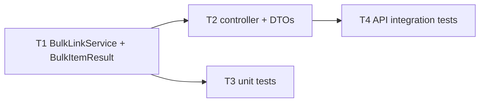
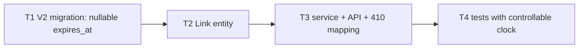

# Scenarios

Each scenario lives in `sdlc-orchestrator/scenarios/<id>/` with a `scenario.json` (the requirement
and, for unattended demos, scripted stakeholder answers) and `replay/`, the recorded agent responses.
Recorded code is real: every run compiles it and runs the full test suite in an isolated workspace.

Run one with `--demo=<id>`; add `--approvals=interactive` to be the human in the loop.

The results below are from actual runs on this machine (replay mode, auto approvals).

| | Greenfield | Brownfield | Ambiguous |
|---|---|---|---|
| Requirement | Bulk link creation API | Link expiration | "Make our short links safer" |
| Human checkpoints | Release | Design, migration change (x2), release | Questions, design, config change, release |
| Re-planning | None | `migration-safety` inserted | `threat-model` inserted; requirements regenerated (v2) |
| Failure and recovery | None | Test failure, then rollback, rework and recovery | None (the manual dashboard run included a rejection and retry) |
| Tests in workspace | 48 pass | 46: 1 failure, then 46 pass | 61 pass |
| Duration | about 70 s | about 125 s | about 55 s |

---

## 1. Greenfield: bulk link creation

> Marketing needs to shorten many URLs at once for campaigns. Add a bulk endpoint that accepts up to
> 100 URLs (each with an optional custom alias) in one request and returns a result for every item, so
> that one bad URL does not fail the whole batch.

**Understanding.** Five acceptance criteria (mixed batch, ordering, size limits, duplicate alias in
one batch, created links resolve). The question "should the status be 207?" is recorded as a
*non-blocking* ambiguity with a stated assumption, so the run is not paused for it.

**Codebase reasoning.** `LinkService.create` already owns validation, alias policy and collision
handling, and runs each insert in its own transaction. So the feature is additive (7 new files, 0
modified) and per-item atomicity comes for free.

**Decomposition** (task DAG, every criterion covered):

**Orchestration.**
- Design impacts are `PUBLIC_API_CHANGE` only, which scores LOW risk, so **no design approval** is needed (risk-based).
- Implementation produces 4 checkpoint commits, one per task.
- `validation`, `security-review` and `documentation` run **in parallel** and join at `release-readiness`, which always requires sign-off.

**Validation.** `mvn test` in the workspace runs 48 tests (41 existing plus 7 new). The security
review finds no high findings, and the `@Valid @RequestBody` check passes. Every item on the release
checklist passes (GO).

**Risk called out by design.** A bulk call consumes one rate-limit token for up to 100 creations.
It is mitigated by the 100-item cap and recorded as a follow-up.

---

## 2. Brownfield: link expiration

> Links should be able to expire. When creating a link, a client can optionally pass expiresInSeconds.
> Once a link has expired, redirects must stop working and return 410 Gone, and the link's metadata
> should show when it expires. Existing links must keep working and never expire.

**Codebase reasoning.** The analysis traces both data flows (create, and the cache-first redirect),
identifies 9 impacted files (7 modified, 2 created), and flags the key constraint: `LinkCache` holds
`ResolvedLink`, so the expiry must be cached as an instant and checked **after** the cache lookup.

**Decomposition.**

**Orchestration, as it actually ran.**

1. **Design approval required**: risk HIGH (score 9) = SCHEMA_CHANGE +3, PUBLIC_API_CHANGE +2, plus 2 high-impact risks +4.
2. **Re-plan**: because the design declares `SCHEMA_CHANGE`, the replanner inserts `migration-safety` before `release-readiness`.
3. **Policy approval before the change is written**: the change set creates `db/migration/V2__add_link_expiry.sql`, which is a protected path. The migration reaches the workspace only after approval.
4. Four parallel branches: validation, security review, documentation and migration safety. Migration safety confirms the change is additive, nullable and versioned above V1.
5. **Validation fails**: `LinkExpiryIntegrationTest.expiringLinkRedirectsUntilExpiryThenReturns410EvenWhenCached` fails with `expected <410> but was <302>`. The first implementation checked expiry only on cache misses, which is exactly the risk the design called out.
6. **Recovery**: the workspace is rolled back to the pre-implementation checkpoint. Implementation and its 5 downstream stages are invalidated (in-flight results are discarded as stale), and the failing test output is attached as feedback. Implementation re-runs (rework cycle 1 of 2), needs the migration approval again, and validation then passes 46/46. `STAGE_RECOVERED` feeds MTTR.
7. Release sign-off, then publish.

The final `COMMITS.txt` contains only the corrected commits. The failed attempt survives in the
artifact history (`implementation@v1`, REJECTED) and the audit trail, not in the code.

---

## 3. Ambiguous: "Make our short links safer"

> Make our short links safer for the people who click them.

**Understanding.** The requirements agent produces a draft (v1) that names the real ambiguity:
- **Q1 (blocking):** which threat? Malicious destinations, guessable codes, or abusive creation.
- **Q2 (blocking):** reject at creation, or show a warning page?
- **Q3 (non-blocking):** blocklist source. It assumes static configuration.

It also notes facts that narrow the problem: codes are already CSPRNG-random and creation is
already rate limited.

**Orchestration, as it actually ran.**

1. The `requirements-clarity` gate returns `NEEDS_INPUT` and the run waits for a human.
2. The stakeholder answers (scripted in auto mode; a radio form in the dashboard): Q1 is malicious destinations, Q2 is reject at creation. Each answer is a `CLARIFICATION` decision.
3. Requirements re-run with the answers and produce **v2**: blocklisted domains (label-boundary matching), IP-literal hosts including decimal and hex encodings, and embedded credentials, all returning 422 `urn:problem:unsafe-destination`.
4. The design is `SECURITY_SENSITIVE + CONFIG_CHANGE + PUBLIC_API_CHANGE`, risk HIGH (8), so it **needs design approval**. The replanner **inserts `threat-model`** before `plan`.
5. The threat model (STRIDE) gives 5 threats with mitigations, and the plan maps each mitigation to a check and a test.
6. Implementation changes `application.yml`, a protected path, so a **config-change approval** happens before it is written.
7. Validation runs 61 tests and passes, then release sign-off and publish.

**Engineering judgement visible in the output.** A separate `SafetyProperties` record avoids
breaking existing tests that construct `ShortenerProperties`. Error messages never echo the URL,
because it may contain credentials. The code also covers a `java.net.URI` edge case: numeric hosts
such as `http://3232235521/` report no host, so the policy falls back to the raw authority.

---

## Recorded responses and variation per attempt

`ReplayLlmClient` looks up `<agent-key>.attempt-<n>.json` before `<agent-key>.json`. That is how the
brownfield scenario reproduces a realistic first-attempt bug and its fix while running the same
engine code as live mode. `@file:` references keep recorded source code as real files, under
`replay/files/`.
